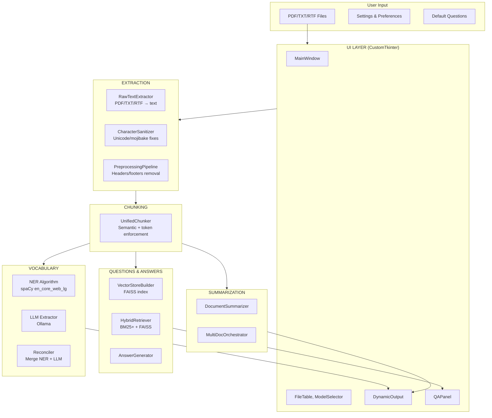
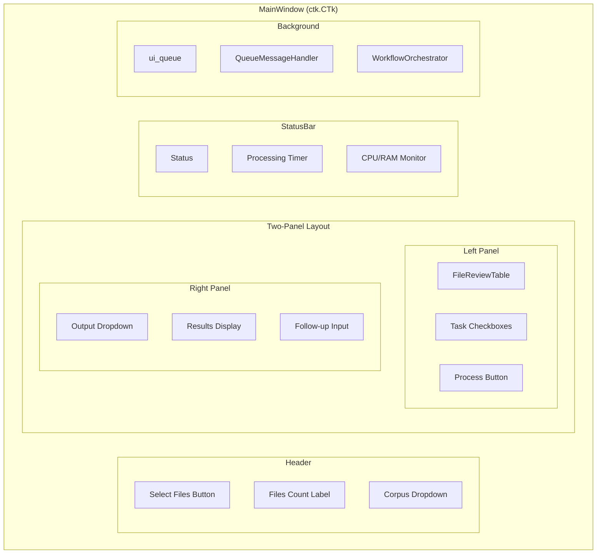
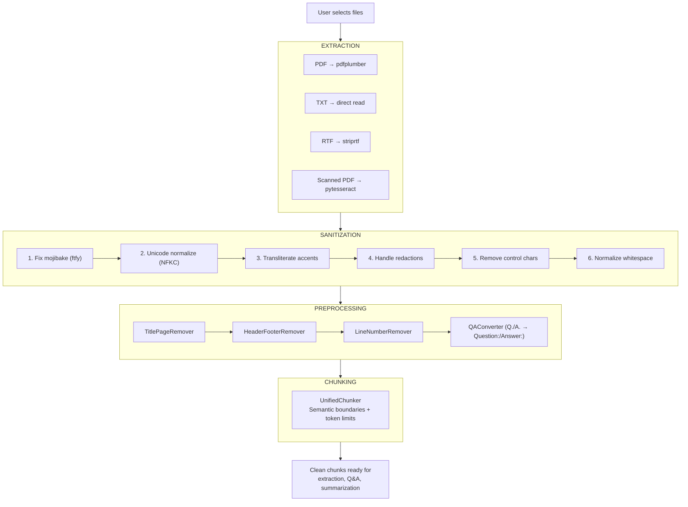
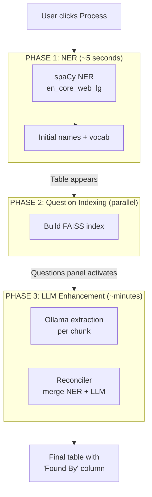
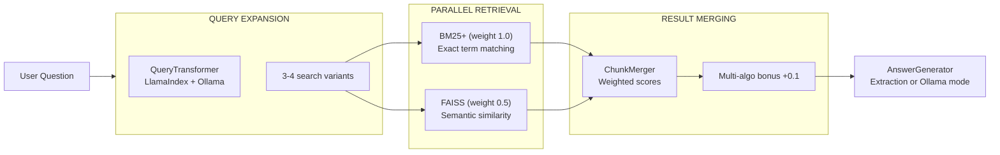
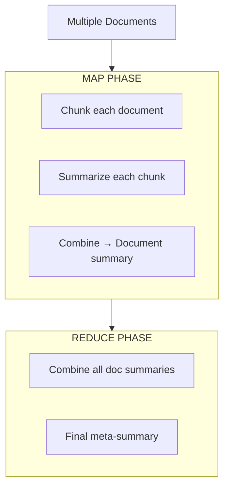

# LocalScribe - Architecture

> **Document Type:** Prescriptive (downstream) — Defines HOW the program works.
> For WHAT and WHY, see [PROJECT_OVERVIEW.md](PROJECT_OVERVIEW.md).
> For technical decisions, see [RESEARCH_LOG.md](RESEARCH_LOG.md).

---

## Quick Navigation

- [Implementation Status](#1-implementation-status)
- [High-Level Overview](#2-high-level-overview)
- [User Interface Layer](#3-user-interface-layer)
- [Processing Pipeline](#4-processing-pipeline)
- [Vocabulary Extraction](#5-vocabulary-extraction)
- [Questions & Answers System](#6-questions--answers-system)
- [Summarization](#7-summarization)
- [Code Patterns](#8-code-patterns)
- [File Directory](#9-file-directory)
- [Development Setup](#10-development-setup)

---

## 1. Implementation Status

### Fully Implemented ✓

- [x] **Document extraction** — PDF (digital + OCR), TXT, RTF via pdfplumber, pytesseract
- [x] **Character sanitization** — 6-stage pipeline (mojibake, Unicode, transliteration, redactions, control chars, whitespace)
- [x] **Smart preprocessing** — Title page, headers/footers, line numbers, Q&A notation removal
- [x] **Vocabulary extraction** — Dual NER + LLM extraction with reconciliation, "Found By" column
- [x] **Questions & Answers system** — Hybrid BM25+ / FAISS retrieval, LlamaIndex query expansion
- [x] **Progressive summarization** — Chunked map-reduce with focus threading
- [x] **Unified semantic chunking** — Token enforcement via tiktoken (400-1200 tokens/chunk)
- [x] **Parallel processing** — Dynamic worker scaling based on CPU/RAM
- [x] **Settings system** — Registry-based, tabbed dialog
- [x] **Progressive extraction worker** — Three-phase NER→Q&A→LLM with unified queue routing (Session 48)

### Partially Implemented ⚡

- [ ] **Case Briefing Generator** — Functional but being deprecated from UI

### Not Yet Built ○

- [ ] Document prioritization (truncate by HIGH/MEDIUM/LOW importance)
- [ ] License server integration
- [ ] Model-aware prompt wrapping (Llama vs Gemma vs Mistral formats)
- [ ] Batch processing mode
- [ ] Export to Word/PDF

---

## 2. High-Level Overview



### Core Design Principles

| Principle | Implementation |
|-----------|----------------|
| **Non-blocking UI** | All heavy processing in background threads |
| **Queue-based messaging** | Workers communicate via `ui_queue` |
| **Pluggable algorithms** | Registry pattern for vocabulary/retrieval algorithms |
| **Graceful degradation** | Fallbacks at every stage if components fail |

---

## 3. User Interface Layer

### MainWindow Structure



### UI Components

| Component | File | Purpose |
|-----------|------|---------|
| `MainWindow` | `ui/main_window.py` | Central coordinator, business logic |
| `WindowLayoutMixin` | `ui/window_layout.py` | Layout creation (separated from logic) |
| `initialize_all_styles` | `ui/styles.py` | Centralized ttk style config (prevents UI freeze) |
| `FileReviewTable` | `ui/widgets.py` | File list with status/confidence |
| `ModelSelectionWidget` | `ui/widgets.py` | Model + prompt dropdown |
| `OutputOptionsWidget` | `ui/widgets.py` | Task checkboxes, word count slider |
| `DynamicOutputWidget` | `ui/dynamic_output.py` | Tabbed results (Vocab/Questions/Summary) |
| `QAPanel` | `ui/qa_panel.py` | Questions & answers with follow-up |
| `QueueMessageHandler` | `ui/queue_message_handler.py` | Routes worker messages to UI |
| `WorkflowOrchestrator` | `ui/workflow_orchestrator.py` | Processing state machine |

### Message Types

| Message | Handler | UI Update |
|---------|---------|-----------|
| `progress` | `handle_progress()` | Progress bar + status |
| `file_processed` | `handle_file_processed()` | FileTable row update |
| `ner_complete` | `handle_ner_complete()` | Initial vocab table |
| `qa_ready` | `handle_qa_ready()` | Enable Questions panel |
| `llm_complete` | `handle_llm_complete()` | Enhanced vocab table |
| `summary_result` | `handle_summary_result()` | Summary display |
| `error` | `handle_error()` | Error dialog |

---

## 4. Processing Pipeline

### Document Processing Stages



### Extraction Details

| Stage | File | Method |
|-------|------|--------|
| PDF text | `extraction/raw_text_extractor.py` | pdfplumber digital extraction |
| OCR detection | `extraction/raw_text_extractor.py` | Dictionary confidence < 60% triggers OCR |
| OCR processing | `extraction/raw_text_extractor.py` | pdf2image + pytesseract at 300 DPI |
| Sanitization | `sanitization/character_sanitizer.py` | 6-stage pipeline |
| Preprocessing | `preprocessing/*.py` | Pluggable removers |

### Chunking Strategy

The `UnifiedChunker` uses semantic chunking with token enforcement:

1. **Semantic splitting** — LangChain SemanticChunker with gradient breakpoints
2. **Token enforcement** — tiktoken (cl100k_base) ensures 400-1200 tokens per chunk
3. **Single pass** — Same chunks used for LLM extraction AND Q&A indexing

---

## 5. Vocabulary Extraction

### Three-Phase Progressive Architecture



### Algorithm Components

| Component | File | Purpose |
|-----------|------|---------|
| `VocabularyExtractor` | `vocabulary/vocabulary_extractor.py` | Orchestrator |
| `NERAlgorithm` | `vocabulary/algorithms/ner_algorithm.py` | spaCy entity extraction |
| `RAKEAlgorithm` | `vocabulary/algorithms/rake_algorithm.py` | Keyword extraction |
| `BM25Algorithm` | `vocabulary/algorithms/bm25_algorithm.py` | Corpus-based TF-IDF |
| `LLMExtractor` | `extraction/llm_extractor.py` | Ollama-based extraction |
| `Reconciler` | `vocabulary/reconciler.py` | Merge NER + LLM results |
| `ResultMerger` | `vocabulary/result_merger.py` | Weighted confidence combination |
| `FeedbackManager` | `vocabulary/feedback_manager.py` | User feedback storage |
| `MetaLearner` | `vocabulary/meta_learner.py` | ML preference learning |

### Algorithm Weights

Centralized in `config.py` for tuning and future ML optimization:

```python
VOCAB_ALGORITHM_WEIGHTS = {
    "NER": 1.0,   # Primary - spaCy, most precise
    "RAKE": 0.7,  # Secondary - good for phrases
    "BM25": 0.8,  # Corpus-based (requires 5+ docs)
}
```

### Per-Algorithm Tracking

Each term tracks which algorithms detected it:
- **NER**, **RAKE**, **BM25** — Boolean columns (Yes/No)
- **Algo Count** — Sum of algorithms that found the term
- UI has "Show Details" toggle to display these columns

### ML Preference Learning

User feedback (thumbs up/down) trains an ensemble model:

```
User Feedback → FeedbackManager (CSV) → VocabularyPreferenceLearner (train)
                                              ↓
New Terms → VocabularyPreferenceLearner (predict) → Quality Score boost/penalty
```

**Graduated Training:**
- 30+ samples: Logistic Regression only
- 200+ samples: Ensemble mode (LR + Random Forest with 23 trees)

**Ensemble Blending:** When both models are active, predictions use confidence-weighted blending. Each model's vote is weighted by its confidence (distance from 0.5), so more certain predictions have more influence.

**Features used (17 total):**
- `quality_score` — Base quality from algorithm weights
- `log_count` — Log-transformed in-case frequency (better low-count discrimination)
- `occurrence_ratio` — Document-relative frequency
- `freq_rank_normalized` — Rank among all terms
- `num_algorithms` — Count of algorithms that found term
- `has_ner`, `has_rake`, `has_bm25` — Algorithm presence flags
- `is_person`, `is_medical`, `is_technical`, `is_place`, `is_unknown` — Term type (one-hot)
- `has_trailing_punctuation`, `has_leading_digit`, `word_count`, `is_all_caps` — Artifact detection

**Time Decay Weighting:**
Older feedback is weighted less to adapt to changing preferences:
- Decay: 1.00 → 0.82 (1yr) → 0.67 (2yr) → 0.55 (3yr)
- Floor: 55% — old feedback always retains significant weight
- Rationale: Most early feedback flags universal false positives (common words) that should persist. Career changes affecting preferences are infrequent.

**Reset options in Settings:**
- "Reset Vocabulary Model" — Restore default model, keep feedback history
- "Reset Model and Clear History" — Complete fresh start

### "Found By" Column

Results show source of each term:
- **Both** — Found by NER and LLM (highest confidence, sorted first)
- **NER** — Found only by spaCy NER
- **LLM** — Found only by Ollama extraction

---

## 6. Questions & Answers System

### Hybrid Retrieval Architecture



### Questions & Answers Components

| Component | File | Purpose |
|-----------|------|---------|
| `VectorStoreBuilder` | `vector_store/vector_store_builder.py` | Creates FAISS indexes |
| `QARetriever` | `vector_store/qa_retriever.py` | Retrieves context |
| `QueryTransformer` | `retrieval/query_transformer.py` | Expands vague questions |
| `HybridRetriever` | `retrieval/hybrid_retriever.py` | Coordinates algorithms |
| `BM25PlusRetriever` | `retrieval/algorithms/bm25_plus.py` | Lexical search |
| `FAISSRetriever` | `retrieval/algorithms/faiss_semantic.py` | Semantic search |
| `ChunkMerger` | `retrieval/chunk_merger.py` | Combines results |
| `QAOrchestrator` | `qa/qa_orchestrator.py` | Coordinates Q&A flow |
| `AnswerGenerator` | `qa/answer_generator.py` | Generates answers |
| `QuestionFlowManager` | `vector_store/question_flow.py` | Branching questions |

### Retrieval Configuration

```python
RETRIEVAL_ALGORITHM_WEIGHTS = {"BM25+": 1.0, "FAISS": 0.5}
RETRIEVAL_MIN_SCORE = 0.1
RETRIEVAL_MULTI_ALGO_BONUS = 0.1
```

**Why BM25+ is primary:** The embedding model (`all-MiniLM-L6-v2`) isn't trained on legal terminology, so semantic search alone often returns "no information found."

---

## 7. Summarization

### Map-Reduce Architecture



### Focus Threading

User's selected prompt template guides every stage:

| Stage | What's Used |
|-------|-------------|
| Focus Extraction | AI extracts emphasis + instructions from template |
| Chunk Prompts | `emphasis` string guides detail capture |
| Document Final | `emphasis` preserves focus in doc summary |
| Meta-Summary | `instructions` structure final output |

### Summarization Components

| Component | File | Purpose |
|-----------|------|---------|
| `ProgressiveSummarizer` | `progressive_summarizer.py` | Chunked summarization |
| `ChunkingEngine` | `chunking_engine.py` | Text chunking (legacy) |
| `UnifiedChunker` | `chunking/unified_chunker.py` | Semantic + token chunking |
| `DocumentSummarizer` | `summarization/document_summarizer.py` | Single doc processing |
| `MultiDocOrchestrator` | `summarization/multi_document_orchestrator.py` | Multi-doc coordination |
| `AIFocusExtractor` | `prompting/focus_extractor.py` | Extract focus from template |
| `MultiDocPromptAdapter` | `prompting/adapters.py` | Stage-specific prompts |

---

## 8. Code Patterns

### Transformation Pipeline Logging

All transformation stages use this pattern for observability:

```python
debug("Starting Stage N: [Stage Name]")
start_time = time.time()
original_len = len(text)

try:
    text = transform(text)
    duration = time.time() - start_time
    debug(f"  ✓ SUCCESS ({duration:.3f}s)")
    debug(f"    Input: {original_len} | Output: {len(text)} | Delta: {len(text) - original_len:+d}")
except Exception as e:
    duration = time.time() - start_time
    debug(f"  ✗ FAILED ({duration:.3f}s) - {type(e).__name__}: {str(e)}")
    raise
```

### Worker Thread Pattern

Background workers extend `BaseWorker` for consistent error handling and cancellation:

```python
from src.ui.base_worker import BaseWorker
from src.ui.queue_messages import QueueMessage

class SomeWorker(BaseWorker):
    def __init__(self, data, ui_queue):
        super().__init__(ui_queue)
        self.data = data

    def execute(self):
        # Check for cancellation at safe points
        self.check_cancelled()
        self.send_progress(50, "Working...")

        result = do_work(self.data)
        self.ui_queue.put(QueueMessage.some_result(result))

    def _cleanup(self):
        # Optional: cleanup resources (called in finally block)
        pass
```

`BaseWorker` provides:
- `stop()` — Signal worker to stop
- `is_stopped` — Check if stop requested
- `check_cancelled()` — Raise InterruptedError if stopped
- `send_progress(pct, msg)` — Send progress update if not stopped
- `send_error(op, exc)` — Log and send error message

For memory-intensive workers, extend `CleanupWorker` which adds automatic garbage collection.

### QueueMessage Factory Pattern

Type-safe queue message construction:

```python
from src.ui.queue_messages import QueueMessage

# Instead of raw tuples:
# ui_queue.put(('progress', (50, 'Working...')))

# Use factory methods:
ui_queue.put(QueueMessage.progress(50, 'Working...'))
ui_queue.put(QueueMessage.error('Something failed'))
ui_queue.put(QueueMessage.file_processed(result))
```

All message types are defined in `src/ui/queue_messages.py` with `MessageType` constants.

### Registry Pattern (Algorithms)

New algorithms register via decorator:

```python
@register_algorithm
class MyNewAlgorithm(BaseAlgorithm):
    name = "my_algorithm"
    weight = 0.6

    def extract(self, text: str) -> AlgorithmResult:
        # Implementation
        pass
```

---

## 9. File Directory

### Source Code (`src/`)

```
src/
├── main.py                      # Entry point
├── config.py                    # Global configuration
├── logging_config.py            # Debug logging setup
├── user_preferences.py          # User settings persistence
├── system_resources.py          # CPU/RAM detection for worker scaling
│
├── ai/                          # Ollama integration
│   ├── ollama_model_manager.py  # REST API client
│   ├── prompt_formatter.py      # Model-specific formatting
│   └── summary_post_processor.py # Length enforcement
│
├── extraction/                  # Document extraction
│   ├── raw_text_extractor.py    # PDF/TXT/RTF → text
│   └── llm_extractor.py         # Ollama-based extraction
│
├── sanitization/
│   └── character_sanitizer.py   # 6-stage Unicode cleanup
│
├── preprocessing/               # Text cleanup
│   ├── base.py                  # BasePreprocessor ABC
│   ├── title_page_remover.py
│   ├── header_footer_remover.py
│   ├── line_number_remover.py
│   └── qa_converter.py          # Q./A. → Question:/Answer:
│
├── chunking/                    # Text chunking
│   └── unified_chunker.py       # Semantic + token enforcement
├── chunking_engine.py           # Legacy chunker
├── progressive_summarizer.py    # Chunked summarization
│
├── vocabulary/                  # Vocabulary extraction
│   ├── vocabulary_extractor.py  # Main orchestrator
│   ├── reconciler.py            # NER + LLM merge
│   ├── result_merger.py         # Algorithm result combination
│   ├── name_deduplicator.py     # Person name deduplication (artifacts + fuzzy)
│   ├── artifact_filter.py       # Substring containment artifact removal
│   ├── role_profiles.py         # Role detection
│   ├── feedback_manager.py      # User feedback CSV
│   ├── meta_learner.py          # ML preference learning (LR + RF ensemble)
│   ├── corpus_manager.py        # BM25 corpus
│   ├── corpus_registry.py       # Multi-corpus management
│   └── algorithms/
│       ├── base.py              # ABC + CandidateTerm
│       ├── ner_algorithm.py     # spaCy NER
│       ├── rake_algorithm.py    # RAKE keywords
│       └── bm25_algorithm.py    # Corpus TF-IDF
│
├── retrieval/                   # Q&A retrieval
│   ├── base.py                  # ABC + dataclasses
│   ├── hybrid_retriever.py      # Coordinates algorithms
│   ├── chunk_merger.py          # Weighted combination
│   ├── query_transformer.py     # LlamaIndex expansion
│   └── algorithms/
│       ├── bm25_plus.py         # BM25+ lexical
│       └── faiss_semantic.py    # FAISS semantic
│
├── vector_store/                # FAISS indexes
│   ├── vector_store_builder.py  # Create indexes
│   ├── qa_retriever.py          # Retrieve context
│   └── question_flow.py         # Branching questions
│
├── qa/                          # Q&A orchestration
│   ├── qa_orchestrator.py       # Coordinates flow
│   └── answer_generator.py      # Generate answers
│
├── summarization/               # Multi-doc summarization
│   ├── result_types.py          # Dataclasses
│   ├── document_summarizer.py   # Single doc
│   └── multi_document_orchestrator.py
│
├── prompting/                   # Prompt management
│   ├── template_manager.py      # Load templates
│   ├── focus_extractor.py       # AI focus extraction
│   ├── adapters.py              # Stage-specific prompts
│   └── config.py                # Prompt parameters
│
├── parallel/                    # Parallel processing
│   ├── executor_strategy.py     # Strategy pattern
│   ├── task_runner.py           # Task orchestration
│   └── progress_aggregator.py   # Throttled updates
│
├── briefing/                    # Case Briefing (deprecated)
│   ├── chunker.py               # Section-aware splitting
│   ├── extractor.py             # Per-chunk extraction
│   ├── aggregator.py            # Merge/deduplicate
│   ├── synthesizer.py           # Narrative generation
│   ├── orchestrator.py          # Pipeline coordinator
│   └── formatter.py             # Output formatting
│
├── ui/                          # User interface
│   ├── main_window.py           # Business logic
│   ├── window_layout.py         # Layout mixin
│   ├── styles.py                # Centralized ttk style config
│   ├── widgets.py               # FileTable, ModelSelector, etc.
│   ├── dynamic_output.py        # Results display
│   ├── qa_panel.py              # Q&A panel
│   ├── qa_question_editor.py    # Edit questions dialog
│   ├── corpus_dialog.py         # Corpus management
│   ├── base_worker.py           # BaseWorker/CleanupWorker classes
│   ├── queue_messages.py        # QueueMessage factory + MessageType
│   ├── workers.py               # Background workers (extend BaseWorker)
│   ├── workflow_orchestrator.py # State machine
│   ├── queue_message_handler.py # Message routing
│   ├── processing_timer.py      # Elapsed time
│   ├── system_monitor.py        # CPU/RAM display
│   ├── tooltip_helper.py        # Tooltips
│   └── settings/
│       ├── settings_dialog.py   # Tabbed dialog
│       ├── settings_registry.py # Setting definitions
│       └── settings_widgets.py  # Custom widgets
│
└── utils/
    ├── logger.py                # Backward-compat wrapper
    ├── text_utils.py            # Text utilities
    ├── tokenizer.py             # Shared BM25 tokenization
    └── pattern_filter.py        # Regex pattern matching for NER
```

### Configuration (`config/`)

```
config/
├── prompts/                     # Summarization templates
│   └── phi-3-mini/
│       ├── factual-summary.txt
│       └── strategic-analysis.txt
├── extraction_prompts/          # LLM extraction prompts
│   ├── combined_extraction.txt  # People + vocab
│   └── vocab_extraction.txt
├── briefing_extraction_prompt.txt # Case Briefing (few-shot)
├── qa_questions.yaml            # Default Q&A questions
├── chunking_config.yaml         # Chunking parameters
├── common_medical_legal.txt     # Vocabulary blacklist
├── medical_terms.txt            # Medical term whitelist
└── legal_exclude.txt            # Legal term blacklist
```

### Tests (`tests/`)

```
tests/
├── test_raw_text_extractor.py
├── test_character_sanitizer.py
├── test_preprocessing.py
├── test_vocabulary_extractor.py
├── test_feedback_ml.py
├── test_bm25_algorithm.py
├── test_hybrid_retrieval.py
├── test_qa_orchestrator.py
├── test_multi_document_summarization.py
├── test_prompt_adapters.py
├── test_progressive_summarizer.py
├── test_parallel.py
└── manual/                      # Require Ollama running
    ├── README.md
    └── test_ollama_workflow.py
```

### User Data (`%APPDATA%/LocalScribe/`)

```
%APPDATA%/LocalScribe/
├── settings.json                # User preferences
├── prompts/                     # Custom prompt templates
├── corpus/                      # BM25 reference corpus
├── vector_stores/               # FAISS indexes (per-session)
├── data/feedback/               # ML feedback CSVs
└── logs/                        # Debug logs
```

---

## 10. Development Setup

### Prerequisites

- Python 3.11+
- Ollama running locally at `http://localhost:11434`
- ~4GB disk space for spaCy model and dependencies

### Installation

```bash
# Clone and enter directory
cd CaseSummarizer

# Create virtual environment
python -m venv .venv

# Activate (Windows)
.venv\Scripts\activate

# Activate (Unix)
source .venv/bin/activate

# Install dependencies
pip install -r requirements.txt

# Download spaCy model
python -m spacy download en_core_web_lg
```

### Running the Application

```bash
# Normal mode
python src/main.py

# Debug mode (verbose logging)
set DEBUG=true && python src/main.py   # Windows CMD
$env:DEBUG="true"; python src/main.py  # Windows PowerShell
DEBUG=true python src/main.py          # Unix
```

### Running Tests

```bash
# All automated tests
python -m pytest tests/ -v

# Specific test file
python -m pytest tests/test_vocabulary_extractor.py -v

# With coverage
python -m pytest tests/ --cov=src --cov-report=html

# Manual tests (require Ollama)
python tests/manual/test_ollama_workflow.py
```

### Linting

```bash
# Run ruff
ruff check src/

# Auto-fix
ruff check src/ --fix
```

---

*Last updated: 2025-12-17*
