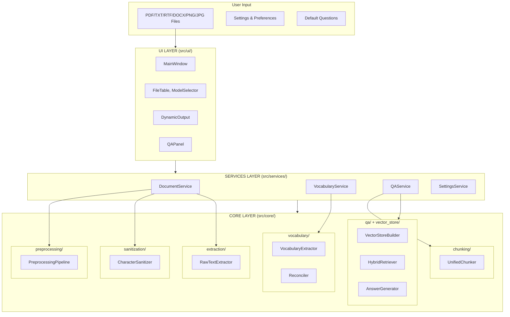
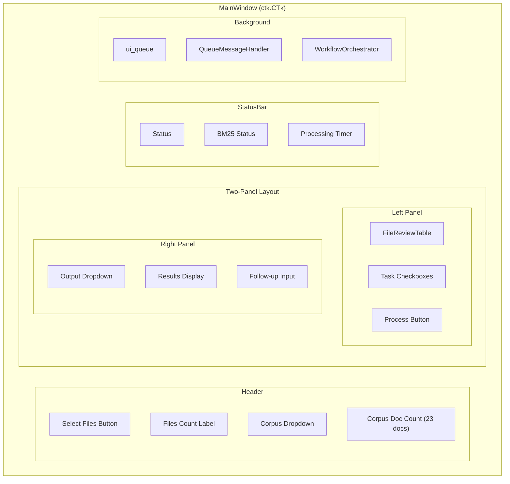
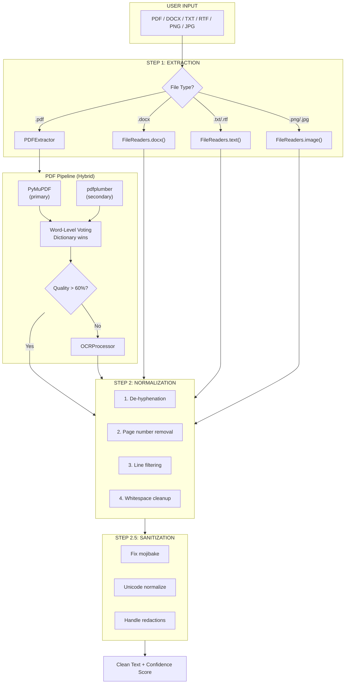
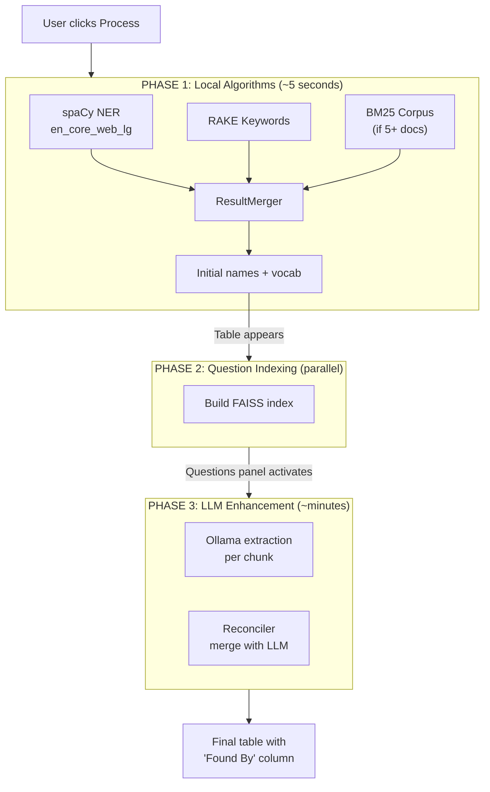
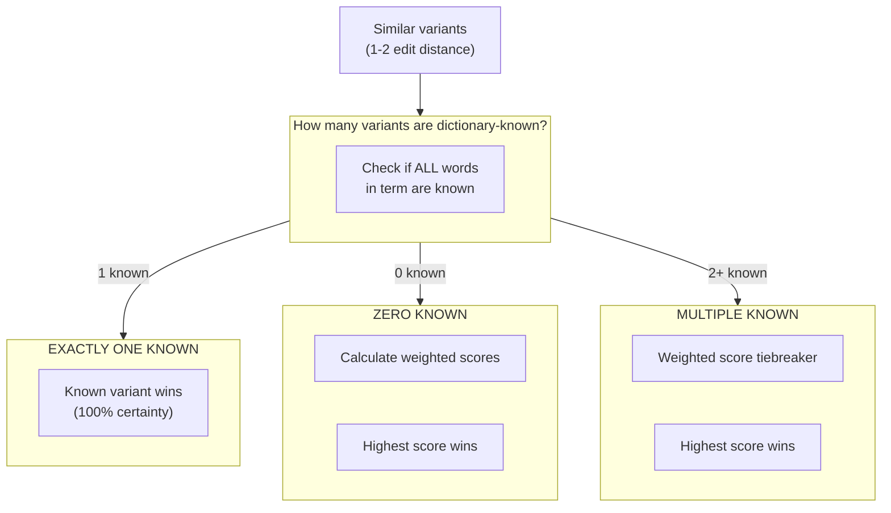
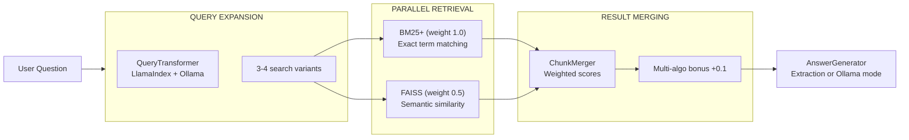
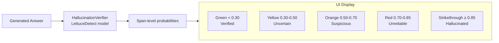
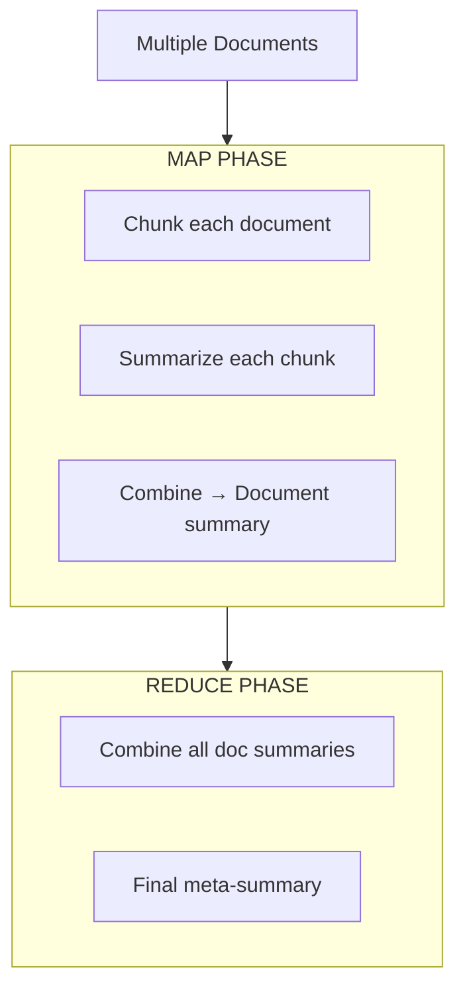

# LocalScribe - Architecture

> **Document Type:** Prescriptive (downstream) — Defines HOW the program works.
> For WHAT and WHY, see [PROJECT_OVERVIEW.md](PROJECT_OVERVIEW.md).
> For technical decisions, see [RESEARCH_LOG.md](RESEARCH_LOG.md).


## Quick Navigation

- [Implementation Status](#1-implementation-status)
- [High-Level Overview](#2-high-level-overview)
- [User Interface Layer](#3-user-interface-layer)
- [Services Layer](#4-services-layer) ← NEW
- [Processing Pipeline](#5-processing-pipeline)
- [Vocabulary Extraction](#6-vocabulary-extraction)
- [Questions & Answers System](#7-questions--answers-system)
- [Summarization](#8-summarization)
- [Code Patterns](#9-code-patterns)
- [File Directory](#10-file-directory)
- [Development Setup](#11-development-setup)

---

## 1. Implementation Status

### Fully Implemented ✓

- [x] **GUI/Logic Separation** — All business logic in `src/core/`, services layer in `src/services/` (Session 57)
- [x] **Document extraction** — PDF (digital + OCR), TXT, RTF, DOCX, PNG/JPG via pdfplumber, pytesseract, python-docx
- [x] **Character sanitization** — 6-stage pipeline (mojibake, Unicode, transliteration, redactions, control chars, whitespace)
- [x] **Smart preprocessing** — Title page, headers/footers, line numbers, page numbers, certification blocks, index pages, Q&A notation (Session 71)
- [x] **Vocabulary extraction** — Dual NER + LLM extraction with reconciliation, "Found By" column
- [x] **Questions & Answers system** — Hybrid BM25+ / FAISS retrieval, LlamaIndex query expansion
- [x] **Hallucination verification** — LettuceDetect-based span-level verification with color-coded display (Session 60)
- [x] **Progressive summarization** — Chunked map-reduce with focus threading
- [x] **Unified semantic chunking** — Token enforcement via tiktoken (400-1000 tokens/chunk, research-based fixed sizes) — CANONICAL
- [x] **Parallel processing** — Dynamic worker scaling based on CPU/RAM, parallel vocabulary algorithms, Q&A questions, LLM chunks (Session 69)
- [x] **Settings system** — Registry-based 5-tab dialog (Performance, Vocabulary, Corpus, Q&A, Experimental) with GPU auto-detection for LLM (Session 62b, Session 64)
- [x] **Progressive extraction worker** — Three-phase NER→Q&A→LLM with unified queue routing (Session 48)
- [x] **Shared config loader** — DRY utility for YAML loading (`src/core/config/loader.py`)
- [x] **Default questions management** — JSON-based storage with enable/disable per question, Settings UI widget (Session 63c)
- [x] **Name regularization** — Post-processing filter for vocabulary fragments and OCR typos (Session 63b)
- [x] **Image preprocessing** — Orientation fix, document crop, deskew, denoise, contrast for scanned PDFs/images (Session 63a, 74)
- [x] **Dynamic LLM context** — Auto-detects optimal context window (4K-64K) based on GPU VRAM; QA context scales accordingly (Session 64, 67)
- [x] **UI feedback enhancements** — Status bar with auto-clear, task preview label, button flash confirmations (Session 69)
- [x] **Algorithm optimizations** — O(n²)→O(n²/26) name dedup, LRU caching, pre-compiled regex, thread-safe Q&A workers (Session 70)
- [x] **FilterChain consolidation** — 6 vocabulary filters unified under VocabularyFilterChain with priority ordering and per-filter stats; CombinedPerTermFilter merges 3→1 pass (Session 71)
- [x] **Export to Word/PDF** — Vocabulary and Q&A export via python-docx and fpdf2; DocumentBuilder abstraction with verification color support; export dropdown consolidates format buttons (Session 72)
- [x] **DOCX + Image import** — Word documents via python-docx, PNG/JPG via existing OCR pipeline (Session 73)
- [x] **Drag-and-drop files** — Drop files onto left panel for processing; tkinterdnd2 integration with CustomTkinter (Session 73)
- [x] **Vector store integrity** — SHA256 hash verification for FAISS stores; prevents deserialization of tampered files (Session 74)
- [x] **Thread-safe Q&A** — Lock-protected `_qa_results` access; fixed TOCTOU race in Ollama worker (Session 74)
- [x] **Combined export** — Single Word/PDF document containing both vocabulary table and Q&A results (Session 73)
- [x] **Session statistics** — Document stats (files, pages, size) and extraction stats (terms, persons, Q&A count) displayed in left panel (Session 73)
- [x] **Export UX improvements** — Remember last export folder, auto-open exported files (configurable), Export Settings tab (Session 73)
- [x] **Pre-ship audit fixes** — 45+ code quality fixes from comprehensive audit: PERF (9), LOGIC (14), UI (3), DOCS (1), REFACTOR (4); query cache, O(n²) dedup fix, export helper refactor (Session 75)
- [x] **GUI workflow test framework** — Automated headless testing simulating full user workflow (load PDFs → preprocess → Process Documents → verify phases); pytest markers for slow/integration tests (Session 77)
- [x] **BM25 corpus manager fix** — Fixed infinite loop bug in `corpus_manager.py` where wrong method name (`extract` vs `process_document`) caused rebuild loop; added safeguard for failed corpus extraction (Session 77)
- [x] **Hybrid PDF extraction** — Dual-extractor pipeline using PyMuPDF (primary) + pdfplumber (secondary) with word-level voting reconciliation; picks dictionary words when extractors disagree; reduces OCR errors from layout misinterpretation (Session 79)
- [x] **Canonical spelling selector** — CanonicalScorer with branching logic: dictionary-known names win automatically, exotic names use confidence-weighted scoring; replaces "top 25% by frequency" approach; 10% penalty for OCR artifacts (Session 78)
- [x] **Per-document term tracking** — TermSources dataclass tracks which documents contributed each term occurrence with confidences; enables weighted scoring for canonical selection (Session 78)
- [x] **ML feature expansion** — 30 features total (7 new TermSources-based: num_source_documents, doc_diversity_ratio, mean/median confidence, confidence_std_dev, high_conf_doc_ratio, all_low_conf) (Session 78)
- [x] **Rule-based scoring with TermSources** — Base quality score incorporates document source quality: +10 for multi-doc terms, +5 for high-conf sources, -10 for all-low-conf, -10 conditional single-source penalty (3+ doc sessions only); configurable in config.py (Session 79)
- [x] **Configurable column visibility** — COLUMN_REGISTRY replaces static lists; 3 new TermSources columns (# Docs, Count, Median Conf); right-click header menu + Settings tab; user preferences persistence; click-to-sort headers (▲/▼ indicators); HTML export with column toggles mirroring GUI; column width persistence (Session 80)
- [x] **Column config consolidation** — Shared `column_config.py` as single source of truth for column definitions; sort warning dialogs for non-Score columns (GUI messagebox + HTML confirm); Term column protected from hiding; real-time term filter above treeview with detach/reattach pattern; regex filter option (Session 80b)
- [x] **Person name casing fix** — ResultMerger forces Title Case for Person entities regardless of algorithm frequency; fixes lowercase names from BM25 ("jenkins" → "Jenkins") (Session 80b)
- [x] **Common-word variant detection** — ArtifactFilter removes Person terms that are canonical_name + common_word(s); uses Google frequency dataset (top 200K = common); fuzzy prefix matching (edit distance ≤2) catches typos like "Luigi Napontano Dob" → "Luigi Napolitano"; `is_common_word()` helper in rarity_filter.py (Session 80b)
- [x] **Extraction module refactor** — Split 1100-line `raw_text_extractor.py` into 6 focused modules: `pdf_extractor.py` (hybrid voting), `ocr_processor.py`, `file_readers.py` (TXT/RTF/DOCX/image), `text_normalizer.py`, `dictionary_utils.py`, `case_number_extractor.py`; facade pattern preserves API; black formatting applied to all src/ (Session 81)

### Partially Implemented ⚡

- [ ] **Case Briefing Generator** — Functional but being deprecated from UI

### Not Yet Built ○

- [ ] License server integration
- [ ] Model-aware prompt wrapping (Llama vs Gemma vs Mistral formats)
- [ ] Batch processing mode

---

## 2. High-Level Overview

### Layered Architecture (Session 57 Refactoring)

The codebase follows a strict **GUI/Logic Separation** pattern:

```
┌─────────────────────────────────────────────────────────────┐
│  USER INPUT                                                 │
│  PDF/TXT/RTF/DOCX/PNG/JPG Files, Settings, Questions        │
└──────────────────────────┬──────────────────────────────────┘
                           ▼
┌─────────────────────────────────────────────────────────────┐
│  src/ui/                 UI LAYER                           │
│  MainWindow, Widgets, QAPanel, DynamicOutput                │
│  (CustomTkinter - NO business logic)                        │
└──────────────────────────┬──────────────────────────────────┘
                           ▼
┌─────────────────────────────────────────────────────────────┐
│  src/services/           SERVICES LAYER                     │
│  DocumentService, VocabularyService, QAService, Settings    │
│  (Clean API - thin wrappers coordinating Core modules)      │
└──────────────────────────┬──────────────────────────────────┘
                           ▼
┌─────────────────────────────────────────────────────────────┐
│  src/core/               CORE LAYER                         │
│  All business logic: extraction, vocabulary, Q&A, etc.      │
│  (15 packages - testable without UI)                        │
└─────────────────────────────────────────────────────────────┘
```

### Data Flow Diagram



### Core Design Principles

| Principle | Implementation |
|-----------|----------------|
| **GUI/Logic Separation** | UI layer has no business logic; all processing in `src/core/` |
| **Services as Interface** | `src/services/` provides clean API between UI and Core |
| **Non-blocking UI** | All heavy processing in background threads (workers) |
| **Queue-based messaging** | Workers communicate via `ui_queue` |
| **Pluggable algorithms** | Registry pattern for vocabulary/retrieval algorithms |
| **DRY** | Shared utilities in `src/core/config/loader.py` |
| **Graceful degradation** | Fallbacks at every stage if components fail |

---

## 3. User Interface Layer

### MainWindow Structure



### UI Components

| Component | File | Purpose |
|-----------|------|---------|
| `MainWindow` | `ui/main_window.py` | Central coordinator, business logic |
| `WindowLayoutMixin` | `ui/window_layout.py` | Layout creation (separated from logic) |
| `FONTS, COLORS, BUTTON_STYLES` | `ui/theme.py` | Centralized theme (fonts, colors, style presets) |
| `initialize_all_styles` | `ui/styles.py` | Centralized ttk style config (prevents UI freeze) |
| `FileReviewTable` | `ui/widgets.py` | File list with status/confidence |
| `ModelSelectionWidget` | `ui/widgets.py` | Model + prompt dropdown |
| `OutputOptionsWidget` | `ui/widgets.py` | Task checkboxes, word count slider |
| `DynamicOutputWidget` | `ui/dynamic_output.py` | Tabbed results (Vocab/Questions/Summary), configurable columns via COLUMN_REGISTRY, right-click header menu, Export All |
| `QAPanel` | `ui/qa_panel.py` | Questions & answers with follow-up, button flash feedback |
| `QueueMessageHandler` | `ui/queue_message_handler.py` | Routes worker messages to UI |
| `WorkflowOrchestrator` | `ui/workflow_orchestrator.py` | Processing state machine |

### Message Types

| Message | Handler | UI Update |
|---------|---------|-----------|
| `progress` | `handle_progress()` | Progress bar + status |
| `file_processed` | `handle_file_processed()` | FileTable row update |
| `ner_complete` | `handle_ner_complete()` | Initial vocab table |
| `qa_ready` | `handle_qa_ready()` | Enable Questions panel |
| `llm_complete` | `handle_llm_complete()` | Enhanced vocab table |
| `summary_result` | `handle_summary_result()` | Summary display |
| `error` | `handle_error()` | Error dialog |

---

## 4. Services Layer

The services layer (`src/services/`) provides a clean API between the UI and Core layers. Each service is a thin wrapper that coordinates multiple core modules.

### Available Services

| Service | Module | Purpose |
|---------|--------|---------|
| `DocumentService` | `document_service.py` | Document extraction, sanitization, preprocessing |
| `VocabularyService` | `vocabulary_service.py` | Vocabulary extraction with feedback tracking |
| `QAService` | `qa_service.py` | Vector index building, question answering |
| `SettingsService` | `settings_service.py` | User preferences with convenience properties |

### Usage Example

```python
from src.services import DocumentService, VocabularyService, QAService

# Process documents
doc_service = DocumentService()
results = doc_service.process_documents(file_paths)
combined_text = doc_service.combine_texts(results)

# Extract vocabulary
vocab_service = VocabularyService()
vocab_data = vocab_service.extract_vocabulary(combined_text)

# Build Q&A index and ask questions
qa_service = QAService()
qa_service.build_index(combined_text)
answer = qa_service.ask_question("Who is the plaintiff?")
```

### Design Rationale

1. **Simplifies UI code** — UI components call one method instead of coordinating multiple modules
2. **Encapsulates complexity** — Services hide the details of module interactions
3. **Enables testing** — Services can be unit tested without UI dependencies
4. **Future-proofs the API** — Internal changes don't affect UI code if the service interface stays stable

---

## 5. Processing Pipeline

### Document Processing Stages



### Extraction Module Structure (Session 81 Refactor)

The `src/core/extraction/` package was refactored from a single 1100-line file into focused modules:

```
src/core/extraction/
    __init__.py                    # Re-exports RawTextExtractor (API unchanged)
    raw_text_extractor.py          # Facade class - orchestration only (~480 lines)
    pdf_extractor.py               # PDF hybrid extraction + word voting (~260 lines)
    ocr_processor.py               # OCR with image preprocessing (~160 lines)
    file_readers.py                # TXT/RTF/DOCX/image readers (~200 lines)
    text_normalizer.py             # 4-stage normalization pipeline (~270 lines)
    dictionary_utils.py            # Dictionary confidence + validation (~170 lines)
    case_number_extractor.py       # Case number regex patterns (~90 lines)
    image_preprocessor.py          # OCR image enhancement (unchanged)
    llm_extractor.py               # LLM-based extraction (unchanged)
```

### Extraction Details

| Stage | File | Method |
|-------|------|--------|
| PDF text | `extraction/pdf_extractor.py` | Hybrid PyMuPDF + pdfplumber with word voting |
| OCR detection | `extraction/pdf_extractor.py` | Dictionary confidence < 60% triggers OCR |
| OCR processing | `extraction/ocr_processor.py` | pdf2image + pytesseract at 300 DPI |
| **OCR preprocessing** | `extraction/image_preprocessor.py` | 8-stage image enhancement (Session 63, 74) |
| Text normalization | `extraction/text_normalizer.py` | 4-stage pipeline (dehyphen, page nums, filter, whitespace) |
| Dictionary utilities | `extraction/dictionary_utils.py` | NLTK words corpus, confidence calculation |
| Non-PDF files | `extraction/file_readers.py` | TXT, RTF (striprtf), DOCX (python-docx), images (OCR) |
| Case numbers | `extraction/case_number_extractor.py` | Regex for federal, NY Index, docket formats |
| Sanitization | `sanitization/character_sanitizer.py` | 6-stage pipeline |
| Preprocessing | `preprocessing/*.py` | Pluggable removers |

### OCR Image Preprocessing (Session 63, 74)

When OCR is triggered for scanned documents or images, an 8-stage preprocessing pipeline improves accuracy by 20-50%:

```mermaid
flowchart LR
    subgraph PhonePrep["PHONE PHOTO PREP (Session 74)"]
        I0a["0a. Orientation<br/>(Tesseract OSD)"]
        I0b["0b. Document<br/>Crop"]
    end

    subgraph Preprocessing["IMAGE PREPROCESSING (Session 63)"]
        I1["1. Grayscale"]
        I2["2. Denoise<br/>(fastNlMeans)"]
        I3["3. CLAHE<br/>(contrast)"]
        I4["4. Adaptive<br/>threshold"]
        I5["5. Deskew<br/>(fine rotation)"]
        I6["6. Border<br/>padding"]
    end

    Input["PDF / Image"] --> Images["pdf2image<br/>300 DPI"]
    Images --> I0a --> I0b
    I0b --> I1
    I1 --> I2 --> I3 --> I4 --> I5 --> I6
    I6 --> Tesseract["pytesseract"]
    Tesseract --> Text["Extracted Text"]
```



**Stage 0a (Orientation):** Detects 90°/180°/270° rotation using Tesseract OSD; skips if confidence < threshold.

**Stage 0b (Document Crop):** OpenCV contour detection finds 4-sided document, applies perspective transform to remove background; skips if no document found.

**Configuration:**
```python
# New (Session 74)
enable_orientation_correction = True      # Detect/fix 90°/180°/270° rotation
orientation_confidence_threshold = 2.0    # Min confidence for correction
enable_document_detection = True          # Crop background from phone photos
min_document_area_ratio = 0.1             # Document must be 10%+ of image

# Existing (Session 63)
OCR_PREPROCESSING_ENABLED = True          # Enable preprocessing pipeline
OCR_DENOISE_STRENGTH = 10                 # 1-30, higher = more smoothing
OCR_ENABLE_CLAHE = True                   # Contrast enhancement
```

**Libraries:** OpenCV (Apache 2.0), deskew (MIT), scikit-image (BSD), pytesseract (Apache 2.0)

### Chunking Strategy

The `UnifiedChunker` uses semantic chunking with token enforcement:

1. **Semantic splitting** — LangChain SemanticChunker with gradient breakpoints
2. **Token enforcement** — tiktoken (cl100k_base) ensures 400-1000 tokens per chunk (research-based fixed sizes, Session 67)
3. **Single pass** — Same chunks used for LLM extraction AND Q&A indexing

---

## 6. Vocabulary Extraction

### Three-Phase Progressive Architecture



### Algorithm Components

| Component | File | Purpose |
|-----------|------|---------|
| `VocabularyExtractor` | `vocabulary/vocabulary_extractor.py` | Orchestrator |
| `NERAlgorithm` | `vocabulary/algorithms/ner_algorithm.py` | spaCy entity extraction |
| `RAKEAlgorithm` | `vocabulary/algorithms/rake_algorithm.py` | Keyword extraction |
| `BM25Algorithm` | `vocabulary/algorithms/bm25_algorithm.py` | Corpus-based TF-IDF |
| `LLMExtractor` | `extraction/llm_extractor.py` | Ollama-based extraction |
| `Reconciler` | `vocabulary/reconciler.py` | Merge NER + RAKE + BM25 + LLM results |
| `ResultMerger` | `vocabulary/result_merger.py` | Weighted confidence combination |
| `RarityFilter` | `vocabulary/rarity_filter.py` | Filter common phrase components |
| `VocabularyFilterChain` | `vocabulary/filters/` | Unified filtering pipeline (Session 71) |
| `CanonicalScorer` | `vocabulary/canonical_scorer.py` | Branching logic for spelling selection (Session 78) |
| `TermSources` | `vocabulary/term_sources.py` | Per-document term tracking (Session 78) |
| `FeedbackManager` | `vocabulary/feedback_manager.py` | User feedback storage |
| `MetaLearner` | `vocabulary/meta_learner.py` | ML preference learning |

### Filtering Strategy

Filtering is split between algorithm-level and centralized:

**Algorithm-level (single-word filtering):**
- NER: Stopwords, rarity threshold, exclude lists, pattern matching
- RAKE: Score threshold, phrase length, stopword removal for single words
- BM25: Score threshold, stopwords, basic validation

**Centralized (multi-word phrase filtering):**
After all algorithms contribute, `rarity_filter.py` filters phrases where ALL component words are common. This catches phrases like "the same" or "left side" that score well algorithmically but provide no vocabulary value.

**Filter pipeline order (Session 71 FilterChain, optimized Session 71):**

Consolidated into `VocabularyFilterChain` with priority-based execution.
Uses `CombinedPerTermFilter` to run 3 per-term checks in a single pass (3→1 loop):

| Priority | Filter | Purpose |
|----------|--------|---------|
| 10 | NameDeduplicationFilter | Fuzzy matching for OCR variants |
| 20 | ArtifactFilter | Substring containment + common-word variants (Session 80b) |
| 30 | NameRegularizerFilter | Remove fragments and 1-char typos |
| 40 | CombinedPerTermFilter | Rarity + Corpus Familiarity + Gibberish in one pass |

**ArtifactFilter Details (Session 80b):**
The ArtifactFilter performs two types of checks:
1. **Substring containment**: Removes terms containing canonical terms (e.g., "Ms. Di Leo:" → removed)
2. **Common-word variants** (Person entities only): Removes terms that are name + common word(s)
   - Uses `is_common_word()` to check if trailing/leading words are in top 200K of Google frequency dataset
   - Exact match: "Luigi Napolitano Patient" removed when "Luigi Napolitano" exists
   - Fuzzy match (edit distance ≤2): "Luigi Napontano Dob" removed (handles OCR typos in names)

Each filter extends `BaseVocabularyFilter` and returns `FilterResult` with statistics.
The chain tracks per-filter removed counts for debugging.

Two factory functions available:
- `create_optimized_filter_chain()` — 4 filters with combined per-term (default)
- `create_default_filter_chain()` — 6 separate filters (for debugging)

### Canonical Spelling Selection (Session 78)

When similar variants are detected (1-2 edit distance), `CanonicalScorer` selects the correct spelling using branching logic:



**Weighted Score Formula:**
```
base_score = (confidence × count) ^ 1.1
penalty = 0.90 if has_ocr_artifacts(term) else 1.0
final_score = base_score × penalty
```

**Example comparison:**
| Spelling | Docs | Confidences | Counts | Weighted Score | OCR Penalty | Final |
|----------|------|-------------|--------|----------------|-------------|-------|
| Jenkins | 2 | [0.95, 0.88] | [5, 2] | (4.75+1.76)^1.1 = 7.8 | None | 7.8 |
| Jenidns | 1 | [0.60] | [8] | (4.8)^1.1 = 5.6 | -10% | 5.0 |

→ "Jenkins" wins despite lower raw count (8 vs 7) because it's dictionary-known.

**OCR artifact patterns** (10% penalty if detected):
- Digit-letter confusion: `0/O`, `1/l/I`, `5/S`, `8/B`
- Ligature-like patterns: `rn→m`, `vv→w` (but NOT common patterns like `cl`, `li`)

### Algorithm Weights

Centralized in `config.py` for tuning and future ML optimization:

```python
VOCAB_ALGORITHM_WEIGHTS = {
    "NER": 1.0,   # Primary - spaCy, most precise
    "RAKE": 0.7,  # Secondary - good for phrases
    "BM25": 0.8,  # Corpus-based (requires 5+ docs)
}
```

### Per-Algorithm Tracking

Each term tracks which algorithms detected it:
- **NER**, **RAKE**, **BM25** — Boolean columns (Yes/No)
- **Algo Count** — Sum of algorithms that found the term
- UI has "Show Details" toggle to display these columns

### GUI Display Columns

**Standard view:** Term | Score | Is Person | Found By | Keep | Skip

**Extended view (Show Details):** Adds NER, RAKE, BM25, Algo Count columns

The Score column displays the ML-adjusted Quality Score (0-100) that determines term ranking. Users see exactly what the model uses to sort terms.

### Rule-Based Quality Score (Session 79)

Before ML blending, a base score is calculated from term features:

```
Base Score: 50 points

+ Occurrence boost:       0-20 pts  (count × 5, capped at 20)
+ Rarity boost:           0-20 pts  (Google frequency rank: rare = more)
+ Person name boost:      +10 pts   (if NER detected as Person)
+ Multi-algorithm boost:  0-10 pts  (algorithms × 3, capped at 10)

# TermSources-based adjustments (when per-document tracking available):
+ Multi-doc boost:        +10 pts   (term found in 2+ documents)
+ High-conf boost:        +5 pts    (>80% of source docs are high confidence)
- All-low-conf penalty:   -10 pts   (ALL sources have confidence < 60%)
- Single-source penalty:  -10 pts   (only 1 low-conf doc, when session has 3+ docs)
─────────────────────────────────────
Final range: 0-100 (clamped)
```

The single-source penalty is **conditional**: it only applies when the extraction session includes 3+ documents. This prevents unfair penalization when processing 1-2 documents where most terms naturally appear in only one source.

Configuration in `config.py`:
- `SCORE_MULTI_DOC_BOOST` — Default +10
- `SCORE_HIGH_CONF_BOOST` — Default +5
- `SCORE_ALL_LOW_CONF_PENALTY` — Default -10
- `SCORE_SINGLE_SOURCE_PENALTY` — Default -10
- `SCORE_SINGLE_SOURCE_MIN_DOCS` — Default 3
- `SCORE_SINGLE_SOURCE_CONF_THRESHOLD` — Default 0.70

### Document Confidence

Document confidence measures OCR/extraction quality (0-100%):
- Digital PDFs: Based on % of words found in English dictionary
- OCR PDFs: Based on OCR engine confidence
- TXT/RTF: Based on dictionary word percentage

This confidence propagates to vocabulary extraction as an ML feature, helping the model learn to down-weight terms from poorly-read documents.

### ML Preference Learning

User feedback (thumbs up/down) trains an ensemble model:

```
User Feedback → FeedbackManager (CSV) → VocabularyPreferenceLearner (train)
                                              ↓
New Terms → VocabularyPreferenceLearner (predict) → Quality Score blend
```

**Two-File Feedback System (Session 55, 69):**
- `config/default_feedback.csv` — Developer training data (currently empty, needs population)
- `%APPDATA%/LocalScribe/data/feedback/user_feedback.csv` — User's own feedback

**Developer Training Data:**
The default_feedback.csv is populated during developer testing to bootstrap the ML model before shipping. Session 79 reset this file to ensure all TermSources features have real values (not mock data).

**Target content for default_feedback.csv:**
- Universal negatives: common phrases, transcript artifacts, OCR errors
- Positive examples: legitimate medical terms, person names, legal terminology
- Real TermSources values from actual multi-document extraction sessions

**Key constraints:**
- Mixed positive/negative examples for balanced training
- Real TermSources feature values (not mock 0.85 placeholders)
- Populated during DEBUG_MODE=True development sessions

**Graduated ML Weight (Session 76):**
ML influence on final score increases with user's training corpus. The shipped model works from day 0, so ML influence starts at 45%:

| User Samples | ML Weight | Formula |
|--------------|-----------|---------|
| 0 | 45% | `score = base * 0.55 + ml_prob * 100 * 0.45` |
| 1-9 | 50% | `score = base * 0.50 + ml_prob * 100 * 0.50` |
| 10-24 | 55% | `score = base * 0.45 + ml_prob * 100 * 0.55` |
| 25-49 | 60% | `score = base * 0.40 + ml_prob * 100 * 0.60` |
| 50-99 | 70% | `score = base * 0.30 + ml_prob * 100 * 0.70` |
| 100-199 | 80% | `score = base * 0.20 + ml_prob * 100 * 0.80` |
| 200+ | 85% | `score = base * 0.15 + ml_prob * 100 * 0.85` |

**Source-Based Training Weights (Session 76):**
User feedback weighted higher than default data from the FIRST observation. Default data is never deleted, just gradually de-emphasized:

| User Samples | Default Weight | User Weight | User Influence* |
|--------------|----------------|-------------|-----------------|
| 0 | 1.0 | — | 0% (only defaults) |
| 1-2 | 1.0 | 1.5 | ~5% |
| 3-9 | 1.0 | 2.0 | ~17% |
| 10-24 | 0.95 | 2.5 | ~47% |
| 25-49 | 0.9 | 3.0 | ~73% |
| 50-99 | 0.8 | 3.5 | ~88% |
| 100-199 | 0.7 | 4.0 | ~95% |
| 200+ | 0.6 | 5.0 | ~97% |

*Approximate influence assuming 30 default samples shipped with app.

**Graduated Training:**
- Program ships with 30+ default observations; retrains on ANY new user feedback
- 200+ samples: Ensemble mode (LR + Random Forest with 23 trees)

**Ensemble Blending:** When both models are active, predictions use confidence-weighted blending. Each model's vote is weighted by its confidence (distance from 0.5), so more certain predictions have more influence.

**Features used (30 total, Session 78 expansion):**

*Frequency features:*
- `log_count` — Log-transformed in-case frequency
- `occurrence_ratio` — Document-relative frequency

*Algorithm features:*
- `has_ner`, `has_rake`, `has_bm25` — Algorithm presence flags

*Type feature:*
- `is_person` — NER person detection (only reliable type signal)

*Artifact detection features:*
- `has_trailing_punctuation`, `has_leading_digit`, `has_trailing_digit` — Punctuation/digit artifacts
- `word_count` — Number of words (4+ suspicious)
- `is_all_caps` — Headers like "PLAINTIFF'S EXHIBIT"
- `is_title_case` — Proper noun detection (Session 68)

*Quality features:*
- `source_doc_confidence` — OCR/extraction quality (Session 54)
- `corpus_familiarity_score` — Proportion of corpus docs containing term (Session 68)

*Session 76 new features:*
- `freq_dict_word_ratio` — Proportion of words found in frequency dictionary
- `all_words_in_freq_dict` — 1 if every word in dictionary (common phrase detection)
- `term_length` — Character count (very short/long = suspicious)
- `vowel_ratio` — Proportion of vowels (gibberish detector)
- `is_single_letter` — Single letter like "Q" or "A" (transcript artifact)
- `has_internal_digits` — Digits in middle of term (OCR artifact)
- `has_medical_suffix` — Ends with -itis, -osis, -ectomy, etc. (legitimate vocabulary)
- `has_repeated_chars` — 3+ same char in a row (artifact)
- `contains_hyphen` — Often legitimate compound terms

*Session 78 TermSources features (7):*
- `num_source_documents` — Number of documents containing this term
- `doc_diversity_ratio` — num_docs / total_docs in session (0-1)
- `mean_doc_confidence` — Count-weighted mean OCR confidence (0-1)
- `median_doc_confidence` — Median confidence, robust to outliers (0-1)
- `confidence_std_dev` — Standard deviation of confidences (consistency signal)
- `high_conf_doc_ratio` — % of source docs with confidence > 0.80
- `all_low_conf` — 1 if ALL source docs have confidence < 0.60 (red flag)

*Removed in Session 76:*
- ~~`quality_score`~~ — Circular dependency (ML was learning to mimic rules)
- ~~`freq_rank_normalized`~~ — Replaced by word-level frequency features
- ~~`num_algorithms`~~ — Redundant (sum of has_ner/rake/bm25)

**Time Decay Weighting:**
Older feedback is weighted less to adapt to changing preferences:
- Decay: 1.00 → 0.82 (1yr) → 0.67 (2yr) → 0.55 (3yr)
- Floor: 55% — old feedback always retains significant weight
- Rationale: Most early feedback flags universal false positives (common words) that should persist. Career changes affecting preferences are infrequent.

**Reset options in Settings:**
- "Reset Vocabulary Model" — Restore default model, keep feedback history
- "Reset Model and Clear History" — Complete fresh start

### "Found By" Column

Results show which algorithms detected each term:
- **NER, RAKE, BM25** — Found by all three algorithms (highest confidence)
- **NER, RAKE** — Found by NER and RAKE
- **NER** — Found only by spaCy NER
- **RAKE** — Found only by RAKE keyword extraction

Terms found by more algorithms rank higher in quality score.

---

## 7. Questions & Answers System

### Hybrid Retrieval Architecture



### Questions & Answers Components

| Component | File | Purpose |
|-----------|------|---------|
| `VectorStoreBuilder` | `vector_store/vector_store_builder.py` | Creates FAISS indexes |
| `QARetriever` | `vector_store/qa_retriever.py` | Retrieves context |
| `QueryTransformer` | `retrieval/query_transformer.py` | Expands vague questions |
| `HybridRetriever` | `retrieval/hybrid_retriever.py` | Coordinates algorithms |
| `BM25PlusRetriever` | `retrieval/algorithms/bm25_plus.py` | Lexical search |
| `FAISSRetriever` | `retrieval/algorithms/faiss_semantic.py` | Semantic search |
| `ChunkMerger` | `retrieval/chunk_merger.py` | Combines results |
| `QAOrchestrator` | `qa/qa_orchestrator.py` | Coordinates Q&A flow |
| `AnswerGenerator` | `qa/answer_generator.py` | Generates answers |
| `HallucinationVerifier` | `qa/hallucination_verifier.py` | Verifies answers for hallucination |
| `QuestionFlowManager` | `vector_store/question_flow.py` | Branching questions |

### Retrieval Configuration

```python
RETRIEVAL_ALGORITHM_WEIGHTS = {"BM25+": 1.0, "FAISS": 0.5}
RETRIEVAL_MIN_SCORE = 0.1
RETRIEVAL_MULTI_ALGO_BONUS = 0.1
QA_RETRIEVAL_K = None           # None = search ALL chunks, or integer for top-K
QA_CONTEXT_WINDOW = 4096        # Fallback; actual value scales with GPU VRAM (Session 67)
```

**Full-Corpus Retrieval (Session 56):**
- `QA_RETRIEVAL_K = None` means ALL chunks are scored and ranked by relevance
- Prevents hallucination from incomplete context (e.g., only seeing document headers)
- Context window protection: Top-ranked chunks are included until 80% of context window is filled
- LLM receives the most relevant chunks from the ENTIRE document corpus, not just top-4

**Why BM25+ is primary:** The embedding model (`all-MiniLM-L6-v2`) isn't trained on legal terminology, so semantic search alone often returns "no information found."

### Answer Generation

Two modes available:
- **Extraction mode** — Fast, deterministic sentence extraction from retrieved context
- **Ollama mode** — AI-synthesized answers using local LLM (default)

**Important:** Ollama mode can hallucinate if retrieved context doesn't contain the answer. The LLM may fill gaps with plausible-sounding but incorrect information. Full-corpus retrieval mitigates this by ensuring the most relevant chunks are always included.

### Hallucination Verification (Session 60)

After answer generation, each answer is verified using LettuceDetect:



**Verification Flow:**
1. `AnswerGenerator` produces answer from retrieved context
2. `HallucinationVerifier.verify()` analyzes answer against context
3. Returns `VerificationResult` with span-level hallucination probabilities
4. If overall reliability < 50%, answer is rejected (replaced with rejection message)
5. Rejected answers also hide citation/source (confusing UX otherwise)
6. UI displays color-coded spans + reliability header + legend

**Configuration:**
```python
HALLUCINATION_VERIFICATION_ENABLED = True  # Global toggle
ANSWER_REJECTION_THRESHOLD = 0.50          # Reject if reliability < 50%
```

**Model Bundling:**
- Model stored at `models/lettucedect-base-modernbert-en-v1/` (~570MB)
- Uses `local_files_only=True` when bundled model exists (no network calls)
- Download script: `scripts/download_hallucination_model.py`

---

## 8. Summarization

### Map-Reduce Architecture



### Focus Threading

User's selected prompt template guides every stage:

| Stage | What's Used |
|-------|-------------|
| Focus Extraction | AI extracts emphasis + instructions from template |
| Chunk Prompts | `emphasis` string guides detail capture |
| Document Final | `emphasis` preserves focus in doc summary |
| Meta-Summary | `instructions` structure final output |

### Summarization Components

| Component | File | Purpose |
|-----------|------|---------|
| `ProgressiveSummarizer` | `progressive_summarizer.py` | Chunked summarization |
| `UnifiedChunker` | `chunking/unified_chunker.py` | Semantic + token chunking (canonical) |
| `DocumentSummarizer` | `summarization/document_summarizer.py` | Single doc processing |
| `MultiDocOrchestrator` | `summarization/multi_document_orchestrator.py` | Multi-doc coordination |
| `AIFocusExtractor` | `prompting/focus_extractor.py` | Extract focus from template |
| `MultiDocPromptAdapter` | `prompting/adapters.py` | Stage-specific prompts |

---

## 9. Code Patterns

### Transformation Pipeline Logging

All transformation stages use this pattern for observability:

```python
debug("Starting Stage N: [Stage Name]")
start_time = time.time()
original_len = len(text)

try:
    text = transform(text)
    duration = time.time() - start_time
    debug(f"  ✓ SUCCESS ({duration:.3f}s)")
    debug(f"    Input: {original_len} | Output: {len(text)} | Delta: {len(text) - original_len:+d}")
except Exception as e:
    duration = time.time() - start_time
    debug(f"  ✗ FAILED ({duration:.3f}s) - {type(e).__name__}: {str(e)}")
    raise
```

### Worker Thread Pattern

Background workers extend `BaseWorker` for consistent error handling and cancellation:

```python
from src.ui.base_worker import BaseWorker
from src.ui.queue_messages import QueueMessage

class SomeWorker(BaseWorker):
    def __init__(self, data, ui_queue):
        super().__init__(ui_queue)
        self.data = data

    def execute(self):
        # Check for cancellation at safe points
        self.check_cancelled()
        self.send_progress(50, "Working...")

        result = do_work(self.data)
        self.ui_queue.put(QueueMessage.some_result(result))

    def _cleanup(self):
        # Optional: cleanup resources (called in finally block)
        pass
```

`BaseWorker` provides:
- `stop()` — Signal worker to stop
- `is_stopped` — Check if stop requested
- `check_cancelled()` — Raise InterruptedError if stopped
- `send_progress(pct, msg)` — Send progress update if not stopped
- `send_error(op, exc)` — Log and send error message

For memory-intensive workers, extend `CleanupWorker` which adds automatic garbage collection.

### QueueMessage Factory Pattern

Type-safe queue message construction:

```python
from src.ui.queue_messages import QueueMessage

# Instead of raw tuples:
# ui_queue.put(('progress', (50, 'Working...')))

# Use factory methods:
ui_queue.put(QueueMessage.progress(50, 'Working...'))
ui_queue.put(QueueMessage.error('Something failed'))
ui_queue.put(QueueMessage.file_processed(result))
```

All message types are defined in `src/ui/queue_messages.py` with `MessageType` constants.

### Button Flash Feedback Pattern

For non-blocking user feedback (replacing modal dialogs):

```python
# Brief button flash instead of messagebox
original_text = self.copy_btn.cget("text")
self.copy_btn.configure(text="Copied!")
self.after(1500, lambda: self.copy_btn.configure(text=original_text))
```

Used in: copy to clipboard, export to CSV/TXT, save to file operations.

### Registry Pattern (Algorithms)

New algorithms register via decorator:

```python
@register_algorithm
class MyNewAlgorithm(BaseAlgorithm):
    name = "my_algorithm"
    weight = 0.6

    def extract(self, text: str) -> AlgorithmResult:
        # Implementation
        pass
```

---

## 10. File Directory

### Source Code (`src/`)

**Architecture Pattern:** GUI/Logic Separation
- `src/core/` - All business logic (AI, extraction, processing)
- `src/services/` - Interface layer between UI and Core
- `src/ui/` - User interface only (no business logic)

```
src/
├── main.py                      # Entry point
├── config.py                    # Global configuration
├── logging_config.py            # Debug logging setup
├── user_preferences.py          # User settings persistence
├── system_resources.py          # CPU/RAM detection for worker scaling
├── categories.py                # Category definitions
├── progressive_summarizer.py    # Chunked summarization (uses UnifiedChunker)
│
├── core/                        # ALL BUSINESS LOGIC
│   ├── config/                  # Shared configuration loading
│   │   └── loader.py            # load_yaml(), load_yaml_with_fallback()
│   │
│   ├── ai/                      # Ollama integration
│   │   ├── ollama_model_manager.py  # REST API client
│   │   ├── prompt_formatter.py      # Model-specific formatting
│   │   └── summary_post_processor.py # Length enforcement
│   │
│   ├── extraction/              # Document extraction (Session 81 refactor)
│   │   ├── raw_text_extractor.py    # Facade - orchestration only
│   │   ├── pdf_extractor.py         # Hybrid PyMuPDF + pdfplumber + voting
│   │   ├── ocr_processor.py         # OCR with image preprocessing
│   │   ├── file_readers.py          # TXT/RTF/DOCX/image handlers
│   │   ├── text_normalizer.py       # 4-stage text normalization
│   │   ├── dictionary_utils.py      # Dictionary confidence + validation
│   │   ├── case_number_extractor.py # Legal case number regex
│   │   ├── image_preprocessor.py    # OCR image preprocessing (Session 63)
│   │   └── llm_extractor.py         # Ollama-based extraction
│   │
│   ├── sanitization/
│   │   └── character_sanitizer.py   # 6-stage Unicode cleanup
│   │
│   ├── preprocessing/           # Text cleanup
│   │   ├── base.py              # BasePreprocessor ABC
│   │   ├── title_page_remover.py
│   │   ├── header_footer_remover.py
│   │   ├── line_number_remover.py
│   │   ├── transcript_cleaner.py # Page nums, cert blocks, index (Session 71)
│   │   └── qa_converter.py      # Q./A. → Question:/Answer:
│   │
│   ├── chunking/                # Text chunking
│   │   └── unified_chunker.py   # Semantic + token enforcement (CANONICAL)
│   │
│   ├── vocabulary/              # Vocabulary extraction
│   │   ├── vocabulary_extractor.py  # Main orchestrator
│   │   ├── column_config.py         # Shared column definitions (Session 80b)
│   │   ├── reconciler.py            # NER + LLM merge
│   │   ├── result_merger.py         # Algorithm result combination
│   │   ├── name_deduplicator.py     # Person name deduplication
│   │   ├── artifact_filter.py       # Substring containment removal
│   │   ├── name_regularizer.py      # Fragment + typo deduplication (Session 63b, 78)
│   │   ├── rarity_filter.py         # Filter common phrases
│   │   ├── corpus_familiarity_filter.py  # Filter corpus-familiar terms (Session 68)
│   │   ├── canonical_scorer.py      # Branching logic for spelling selection (Session 78)
│   │   ├── term_sources.py          # Per-document term tracking (Session 78)
│   │   ├── person_utils.py          # Centralized person detection (Session 70)
│   │   ├── role_profiles.py         # Role detection
│   │   ├── feedback_manager.py      # User feedback CSV
│   │   ├── meta_learner.py          # ML preference learning
│   │   ├── corpus_manager.py        # BM25 corpus
│   │   ├── corpus_registry.py       # Multi-corpus management
│   │   ├── filters/                 # FilterChain pipeline (Session 71)
│   │   │   ├── base.py              # BaseVocabularyFilter, FilterResult
│   │   │   ├── filter_chain.py      # VocabularyFilterChain orchestrator
│   │   │   ├── combined_per_term.py # Rarity + Corpus + Gibberish in 1 pass
│   │   │   └── *.py                 # 6 wrapper filters (dedup, artifact, etc.)
│   │   └── algorithms/
│   │       ├── base.py              # ABC + CandidateTerm
│   │       ├── ner_algorithm.py     # spaCy NER
│   │       ├── rake_algorithm.py    # RAKE keywords
│   │       └── bm25_algorithm.py    # Corpus TF-IDF
│   │
│   ├── retrieval/               # Q&A retrieval
│   │   ├── base.py              # ABC + dataclasses
│   │   ├── hybrid_retriever.py  # Coordinates algorithms
│   │   ├── chunk_merger.py      # Weighted combination
│   │   ├── query_transformer.py # LlamaIndex expansion
│   │   └── algorithms/
│   │       ├── bm25_plus.py     # BM25+ lexical
│   │       └── faiss_semantic.py # FAISS semantic
│   │
│   ├── vector_store/            # FAISS indexes
│   │   ├── vector_store_builder.py  # Create indexes
│   │   ├── qa_retriever.py          # Retrieve context
│   │   └── question_flow.py         # Branching questions
│   │
│   ├── qa/                      # Q&A orchestration
│   │   ├── qa_orchestrator.py   # Coordinates flow
│   │   ├── answer_generator.py  # Generate answers
│   │   └── default_questions_manager.py  # JSON-based question storage (Session 63c)
│   │
│   ├── summarization/           # Multi-doc summarization
│   │   ├── result_types.py      # Dataclasses
│   │   ├── document_summarizer.py   # Single doc
│   │   └── multi_document_orchestrator.py
│   │
│   ├── prompting/               # Prompt management
│   │   ├── template_manager.py  # Load templates
│   │   ├── focus_extractor.py   # AI focus extraction
│   │   ├── adapters.py          # Stage-specific prompts
│   │   └── config.py            # Prompt parameters
│   │
│   ├── export/                  # Word/PDF export (Session 72)
│   │   ├── base.py              # DocumentBuilder ABC, TextSpan, verification colors
│   │   ├── word_builder.py      # python-docx implementation
│   │   ├── pdf_builder.py       # fpdf2 implementation
│   │   ├── vocab_exporter.py    # Vocabulary table formatting
│   │   └── qa_exporter.py       # Q&A formatting with verification colors
│   │
│   ├── parallel/                # Parallel processing
│   │   ├── executor_strategy.py # Strategy pattern
│   │   ├── task_runner.py       # Task orchestration
│   │   └── progress_aggregator.py # Throttled updates
│   │
│   └── briefing/                # Case Briefing (deprecated)
│       ├── chunker.py, extractor.py, aggregator.py
│       ├── synthesizer.py, orchestrator.py, formatter.py
│
├── services/                    # INTERFACE LAYER (UI → Core)
│   ├── document_service.py      # Document processing
│   ├── vocabulary_service.py    # Vocabulary extraction
│   ├── qa_service.py            # Q&A operations
│   ├── settings_service.py      # User preferences
│   └── export_service.py        # Word/PDF export (Session 72)
│
├── ui/                          # USER INTERFACE ONLY
│   ├── main_window.py           # Main window
│   ├── window_layout.py         # Layout mixin
│   ├── theme.py                 # Centralized fonts, colors, style presets
│   ├── styles.py                # Centralized ttk style config
│   ├── widgets.py               # FileTable, ModelSelector, etc.
│   ├── dynamic_output.py        # Results display
│   ├── qa_panel.py              # Q&A panel
│   ├── qa_question_editor.py    # Edit questions dialog
│   ├── corpus_dialog.py         # Corpus management
│   ├── base_worker.py           # BaseWorker/CleanupWorker classes
│   ├── queue_messages.py        # QueueMessage factory + MessageType
│   ├── workers.py               # Background workers (extend BaseWorker)
│   ├── workflow_orchestrator.py # State machine
│   ├── queue_message_handler.py # Message routing
│   ├── processing_timer.py      # Elapsed time
│   ├── system_monitor.py        # CPU/RAM display
│   ├── tooltip_helper.py        # Tooltips
│   └── settings/
│       ├── settings_dialog.py   # Tabbed dialog
│       ├── settings_registry.py # Setting definitions
│       └── settings_widgets.py  # Custom widgets
│
└── utils/
    ├── logger.py                # Backward-compat wrapper
    ├── text_utils.py            # Text utilities (combine_document_texts, get_documents_folder)
    ├── tokenizer.py             # Shared BM25 tokenization
    ├── pattern_filter.py        # Regex pattern matching for NER/OCR errors
    ├── gibberish_filter.py      # Spell-check based gibberish detection
    └── ocr_patterns.py          # OCR artifact detection for canonical scoring (Session 78)
```

### Configuration (`config/`)

```
config/
├── prompts/                     # Summarization templates
│   └── phi-3-mini/
│       ├── factual-summary.txt
│       └── strategic-analysis.txt
├── extraction_prompts/          # LLM extraction prompts
│   ├── combined_extraction.txt  # People + vocab
│   └── vocab_extraction.txt
├── briefing_extraction_prompt.txt # Case Briefing (few-shot)
├── qa_questions.yaml            # Default Q&A questions
├── chunking_config.yaml         # Chunking parameters
├── common_medical_legal.txt     # Vocabulary blacklist
├── medical_terms.txt            # Medical term whitelist
└── legal_exclude.txt            # Legal term blacklist
```

### Tests (`tests/`)

```
tests/
├── test_raw_text_extractor.py
├── test_character_sanitizer.py
├── test_preprocessing.py
├── test_vocabulary_extractor.py
├── test_feedback_ml.py
├── test_bm25_algorithm.py
├── test_hybrid_retrieval.py
├── test_qa_orchestrator.py
├── test_multi_document_summarization.py
├── test_prompt_adapters.py
├── test_progressive_summarizer.py
├── test_parallel.py
├── test_canonical_scorer.py     # CanonicalScorer branching logic tests (Session 78)
├── test_name_regularizer.py     # Name fragment + typo filter tests
└── manual/                      # Require Ollama running
    ├── README.md
    └── test_ollama_workflow.py
```

### User Data (`%APPDATA%/LocalScribe/`)

```
%APPDATA%/LocalScribe/
├── settings.json                # User preferences
├── prompts/                     # Custom prompt templates
├── corpus/                      # BM25 reference corpus
├── vector_stores/               # FAISS indexes (per-session)
├── data/feedback/               # ML feedback CSVs
└── logs/                        # Debug logs
```

---

## 11. Development Setup

### Prerequisites

- Python 3.11+
- Ollama running locally at `http://localhost:11434`
- ~4GB disk space for spaCy model and dependencies

### Installation

```bash
# Clone and enter directory
cd CaseSummarizer

# Create virtual environment
python -m venv .venv

# Activate (Windows)
.venv\Scripts\activate

# Activate (Unix)
source .venv/bin/activate

# Install dependencies
pip install -r requirements.txt

# Download spaCy model
python -m spacy download en_core_web_lg
```

### Running the Application

```bash
# Normal mode
python src/main.py

# Debug mode (verbose logging)
set DEBUG=true && python src/main.py   # Windows CMD
$env:DEBUG="true"; python src/main.py  # Windows PowerShell
DEBUG=true python src/main.py          # Unix
```

### Running Tests

```bash
# Quick tests (skips slow integration tests) - ~30 seconds
python -m pytest tests/ -v -m "not slow"

# All automated tests (includes GUI workflow simulation) - ~3+ minutes
python -m pytest tests/ -v

# GUI workflow tests only (simulates full user workflow)
python -m pytest tests/test_gui_workflow.py -v

# Quick diagnostic tests (worker health, queue, embeddings, Ollama)
python -m pytest tests/test_gui_workflow.py::TestDiagnostics -v

# Specific test file
python -m pytest tests/test_vocabulary_extractor.py -v

# With coverage
python -m pytest tests/ --cov=src --cov-report=html

# Manual tests (require Ollama)
python tests/manual/test_ollama_workflow.py
```

### Linting

```bash
# Run ruff
ruff check src/

# Auto-fix
ruff check src/ --fix
```

---

*Last updated: 2026-01-05 (Session 80b - Column config, Person name casing, common-word variant detection)*
